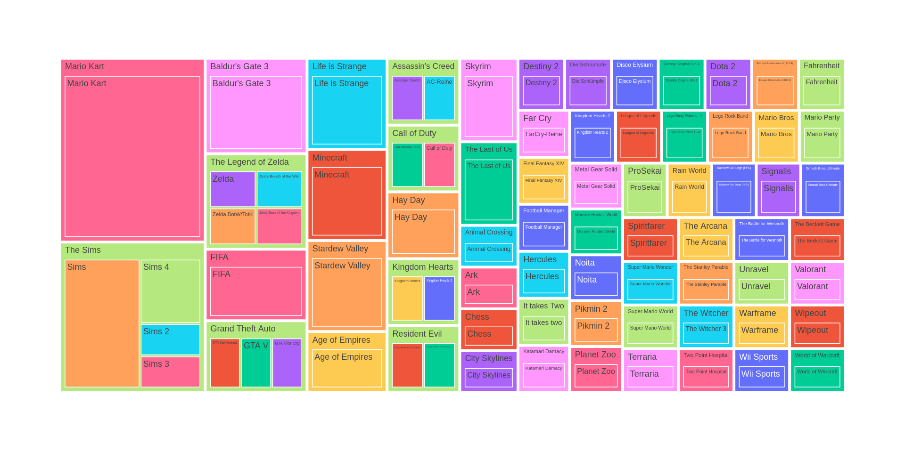

# Games und Literatur (Sommersemester 2024)

:warning: Das Seminar lief vom 15. April 2024 bis 15. Juli 2024 an der Freien Universität Berlin. Der hier veröffentlichte **Seminarplan** ist als Dokumentation gedacht.

**Ort:** JK 29/118 (Habelschwerdter Allee 45) \
**Zeit:** Mo 14:00–16:00

## Motto

*»Der wahre Leser muß der erweiterte Autor sein.«*

– Novalis, Vermischte Bemerkungen ([Nr. 125](http://novalis.autorenverzeichnis.de/vermischte_bemerkungen/vb_125.html))

## Veranstaltungsbeschreibung

 In diesem Seminar werden die vielfältigen Beziehungen zwischen Literatur und Computerspielen untersucht und diskutiert. Dabei werden wir uns mit der Frage auseinandersetzen, wie Computerspiele literarische Texte adaptieren, sich auf literarische Traditionen beziehen und eigene narrative Formen und Techniken entwickeln. Das Seminar bietet eine Einführung in die wichtigsten theoretischen Konzepte und Debatten in diesem Bereich und stellt eine Auswahl von Computerspielen vor, die sich auf kanonische literarische Werke beziehen oder von diesen inspiriert wurden. Die Themen reichen von der Analyse konkreter Spiele und ihrer literarischen Bezüge über die Untersuchung von narrativen Techniken und ästhetischen Strategien bis hin zu den politischen, kulturellen und gesellschaftlichen Kontexten, in denen Computerspiele entstehen und rezipiert werden.

## Verantwortlich

- [Dr. Dîlan Canan Çakir](https://www.temporal-communities.de/people/cakir/index.html)
- [Prof. Dr. Frank Fischer](https://lehkost.github.io/)

## Organisatorisches

- [Eintrag im VV der FU](https://www.fu-berlin.de/vv/de/lv/870181)

## Übersicht

### 1. Sitzung: Einstieg (15.04.2024)

- Vorstellungsrunde
- Anwesenheitsliste
- Bedingungen für die Bestätigung der aktiven Teilnahme
  - Beteiligung an einem Referat
  - Bericht vom Besuch im [Computerspielemuseum Berlin](https://www.berlin.de/museum/3110084-2926344-computerspielemuseum.html)
- Voraussetzungen für eine Hausarbeit
  - Thema absprechen
  - Gliederung vorschlagen
  - Abgabetermin: 30.09.2024
- Präsentation zur Einführung (Folien)
- Besprechung des Seminarplans und Verteilung der Referate

### 2. Sitzung: Was ist Literatur? (22.04.2024)

- Orga
  - Umfrage Games (bis 29.04.2024 ausfüllen)
- Kahoot-Quiz
  - 5 Fragen
- Lektüre für die Sitzung (obligatorisch)
  - Jonathan Culler: **Was ist Literatur und ist sie wichtig?** In: ders.: *Literaturtheorie. Eine kurze Einführung.* Aus dem Englischen übersetzt von Andreas Mahler. Stuttgart: Reclam 2002, S. 31–63.
  - Terry Eagleton: **Einleitung: Was ist Literatur?** In: ders.: *Einführung in die Literaturtheorie.* 5., durchgesehene Auflage. Aus dem Englischen von Elfi Bettinger und Elke Hentschel. Stuttgart, Weimar: Metzler 2012, S. 1–16.
- Lektüre für die Sitzung (fakultativ)
  - Rainer Baasner: **Art. ›Literaturwissenschaft‹ (Unterpunkt 5).** In: Horst Brunner, Rainer Moritz (Hg.): *Literaturwissenschaftliches Lexikon. Grundbegriffe der Germanistik.* 2., überarbeitete Auflage. Berlin: Schmidt 2006, S. 239–240.
  - Rainer J. Kaus: **Literatur als Meta-Sprache und die Proto-Sprache des Unbewussten.** In: ders./Hartmut Günther (Hg.): *Was ist Literatur? / What is Literature?* Berlin: Frank &amp; Timme 2017, S. 69–88.

### 3. Sitzung: Zur digitalen Literatur I (29.04.2024)

- Lektüre für die Sitzung (obligatorisch)
  - Hannes Bajohr, Annette Gilbert: **Platzhalter der Zukunft: Digitale Literatur II (2001 → 2021).** In: dies. (Hg.): *Digitale Literatur II.*
München: edition text+kritik 2021, S. 7–21. ([doi:10.5771/9783967075496-7](https://doi.org/10.5771/9783967075496-7))
  - Roberto Simanowski: **Autorschaften in digitalen Medien. Eine Einleitung.** In: Heinz Ludwig Arnold (Hg.): *Digitale Literatur.* München: edition text+kritik 2001, S. 3–21.
- Lektüre für die Sitzung (fakultativ)
  - Hannes Bajohr: **Das Reskilling der Literatur. Über das Verhältnis von Code und Konzept.** In: ders.: *Schreibenlassen. Texte zur Literatur im Digitalen.* Berlin: August Verlag 2022, S. 69–81.
  - Hannes Bajohr: **Was ist Literatur? Eine Minimalposition.** In: ebd., S. 125–126.
  - Hanna Engelmeier: [**Was ist die Literatur in »Digitale Literatur«?**](https://www.merkur-zeitschrift.de/artikel/was-ist-die-literatur-in-digitale-literatur-a-mr-71-12-31/) In: *Merkur. Deutsche Zeitschrift für europäisches Denken.* Heft 823 (Dezember 2017), S. 31–45.
- Recap ›Literaturbegriff‹
  - pragmatisch
  - deskriptiv
  - normativ
- Aristoteles: **Poetik** (4. Jahrhundert v. Z.)
  - »*Der Geschichtsschreiber* und der *Dichter* unterscheiden sich nämlich nicht durch die gebundene oder ungebundene Rede, denn man könnte das Werk des Herodot in Verse setzen und es würde nach wie vor eine Art Geschichtsdarstellung sein, mit Versmaß oder ohne Verse. Der Unterschied ist vielmehr der, daß jener, was sich zugetragen darstellt, dieser, was sich hätte zutragen können.« ([gutenberg.org](https://www.gutenberg.org/files/16880/16880-h/16880-h.htm))

### 4. Sitzung: Zur digitalen Literatur II (06.05.2024)

- Lektüre für die Sitzung
  - Espen Aarseth: **Introduction: Ergodic Literature.** In: ders.: *Cybertext. Perspectives on Ergodic Literature.* Baltimore: The Johns Hopkins University Press 1997, S. 1–23.
  - Espen Aarseth, Gordon Calleja: [**The Word Game: The Ontology of an Indefinable Object.**](http://www.fdg2015.org/papers/fdg2015_paper_51.pdf) In: Proceedings of the 10th International Conference on the Foundations of Digital Games (FDG 2015). 22.–25. Juni 2015, Pacific Grove.
- Texte der digitalen Literatur (späte 1990er-Jahre) / Medienarchäologie
  - Projekt des DLA Marbach [»Netzliteratur authentisch archivieren und verfügbar machen«](https://wwik-prod.dla-marbach.de/line/) (2013–2015)
  - Susanne Berkenheger: [Zeit für die Bombe](https://wwik.dla-marbach.de/line/index.php/Zeit_f%C3%BCr_die_Bombe) (1997)
    - [Screencast](http://literatur-im-netz.dla-marbach.de/jspview/downloads/frei/ea293425-4ae6-48cd-ba9c-96b1d4e614ab/2/screencast_00.mp4)
    - [Emulation im Internet Explorer 6](https://oldweb.today/?browser=ie6#http://www.berkenheger.netzliteratur.net/ouargla/wargla/zeit.htm)
  - Frank Klötgen, Dirk Günther: [Die Aaleskorte der Ölig](https://wwik.dla-marbach.de/line/index.php/Die_Aaleskorte_der_%C3%96lig) (1998)
    - [Screencast](http://literatur-im-netz.dla-marbach.de/jspview/downloads/frei/25f60c53-f9b1-4d0e-b18d-993b0538d6ab/2/screencast_00.mp4)
    - [Emulation im Internet Explorer 6](https://oldweb.today/?browser=ie6#http://www.aaleskorte.de)

### 5. Sitzung: Was ist ein Computerspiel? Was sind Game Studies? Narration und Computerspiele (13.05.2024)

- Orga
  - Auswertung der Umfrage Games (Visualisierung: Viktor Illmer :pray:)

- Lektüre für die Sitzung (obligatorisch)
  - Gundolf S. Freyermuth: **What is a Game? Systematic and Historical Approaches.** In: ders.: *Games / Game Design / Game Studies. An Introduction.* Bielefeld: Transcript 2015, S. 35–41. ([doi:10.1515/9783839429839-003](https://doi.org/10.1515/9783839429839-003))
  - Rudolf Thomas Inderst, Pascal Wagner: **#GameStudies. 20 Jahre Forschungsfantasie: Von der Disziplinierung eines Mediums.** Mit einem Geleitwort von Denise Gühnemann. Marburg: Büchner 2022, S. 9–25.
  - Jan-Noël Thon: **Game Studies und Narratologie.** In: Klaus Sachs-Hombach, Jan-Noël Thon (Hg.): *Game Studies. Aktuelle Ansätze der Computerspielforschung.* Köln: Halem 2015, S. 104–164.
- Lektüre für die Sitzung (fakultativ)
  - Dîlan Canan Çakir, Sandra Richter: [**Games-Geschichten. Erzählen per Computerspiel.**](https://www.kas.de/de/web/die-politische-meinung/artikel/detail/-/content/games-geschichten) In: Die Politische Meinung 67 (2022), S. 80–84.
  - Simon Egenfeldt-Nielsen, Jonas Heide Smith, Susana Pajares: **Studying Video Games.** In: dies.: *Understanding Video Games. The Essential Introduction.* Vierte Auflage. New York: Routledge 2020, S. 7–14.
  - Dies.: **The Game Industry.** In: ebd., S. 15–29.
  - Dies.: **Narrative.** In: ebd., S. 201–240.
- Tafelbild zur Entwicklung und Terminologie der Ludologie seit Johan Huizingas »Homo ludens« (1938)
- Nachschlagewerke
  - Benjamin Beil, Thomas Hensel, Andreas Rauscher (Hg.): *Game Studies.* Wiesbaden: Springer VS 2018. ([doi:10.1007/978-3-658-13498-3](https://doi.org/10.1007/978-3-658-13498-3))
  - Olaf Zimmermann, Felix Falk (Hg.): [*Handbuch Gameskultur. Über die Kulturwelten von Games.*](https://www.kulturrat.de/publikationen/handbuch-gameskultur/) Kulturrat 2020.

### 6. Sitzung: Gaming Literacy: Computerspiele lesen (27.05.2024)

- Lektüre für die Sitzung (obligatorisch)
  - Hanns Christian Schmidt: **Bausteine einer postdigitalen Computerspielkompetenz: Ludische Literalität und Lego-Steine.** In: Ralf Biermann, Johannes Fromme, Florian Kiefer (Hg.): *Computerspielforschung: Interdisziplinäre Einblicke in das digitale Spiel und seine kulturelle Bedeutung.* Opladen, Berlin, Toronto: Budrich 2023, S. 323–348. ([doi:10.2307/jj.1791917.18](https://doi.org/10.2307/jj.1791917.18))
  - Eric Zimmerman: **Gaming Literacy: Game Design as a Model for Literacy in the Twenty-First Century.** In: Bernard Perron, Mark J. P. Wolf (Hg.): *The Video Game Theory Reader 2.* New York: Routledge 2008, S. 23–31. ([doi:10.4324/9780203887660-7](https://doi.org/10.4324/9780203887660-7))
- Lektüre für die Sitzung (fakultativ)
  - Ian Bogost: **The Rhetoric of Video Games.** In: Katie Salen (Hg.): *The Ecology of Games: Connecting Youth, Games, and Learning.* Cambridge, MA: The MIT Press 2008, S. 117–139. ([PDF](https://se4n.org/papers/bogost-rhetoric.pdf))
  - [https://en.wikipedia.org/wiki/Something_Something_Soup_Something](https://en.wikipedia.org/wiki/Something_Something_Soup_Something)

### 7. Sitzung: Online-Vortrag (03.06.2024)

- Gastvortrag an der Universität Leipzig (live im Seminar via Zoom)
  - Dîlan Canan Çakir: Games als literarisches Phänomen

### 8. Sitzung: Selbststudium (10.06.2024)

- Besuch im [Computerspielemuseum Berlin](https://www.berlin.de/museum/3110084-2926344-computerspielemuseum.html)

### 9. Sitzung: Kafka-Games (17.06.2024)

- Lektüre für die Sitzung (obligatorisch)
  - Franz Kafka: Die Verwandlung
  - Franz Kafka: In der Strafkolonie
- Spiele für die Sitzung
  - [Metamorphosis](https://en.wikipedia.org/wiki/Metamorphosis_(video_game))
  - [The Stanley Parable](https://de.wikipedia.org/wiki/The_Stanley_Parable)
  - [Playing Kafka](https://www.goethe.de/ins/cz/de/kul/the/plk.html)
  - [The Franz Kafka Videogame](https://en.wikipedia.org/wiki/The_Franz_Kafka_Videogame)
  - [Papers, Please](https://en.wikipedia.org/wiki/Papers,_Please)
- Rezensionen zu Kafka-Games (Auswahl)
  - Bad Mojo (1996), Bad Mojo Redux (2004)
    - Arinn Dembo: [Twilight of the Cockroach: Bad Mojo Evokes Kafka So Well It’ll Turn Your Stomach.](https://archive.org/details/Computer_Gaming_World_Issue_143/page/n109/mode/2up?view=theater) In: Computer Gaming World, Heft 143 (Juni 1996), S. 106–110.
    - Rainer Sigl: [Literatur als Game: Joyce, Burroughs ... wie wärs mit Kafka?](https://videogametourism.at/content/literatur-als-game-joyce-burroughs-wie-waers-mit-kafka) In: VideoGameTourism, 17.01.2012.
  - The Franz Kafka Videogame (2017)
    - Larissa Baiter: [Puzzeln, rätseln und viel rumklicken.](https://www.games.ch/franz-kafka-game/test/review-ZhX/) In: games.ch, 19.04.2017.
    - Zeichensetzerin Alexa: [The Franz Kafka Videogame: Ein kafkaeskes Spiel?](https://buecherstadtkurier.com/the-franz-kafka-videogame-ein-kafkaeskes-spiel/) In: Bücherstadt Magazin, 26.04.2020.
  - Metamorphosis (2020)
    - Jack Allin: [Review for Metamorphosis.](https://adventuregamers.com/articles/view/metamorphosis) In: Adventure Gamers, 11.09.2020.
    - Christopher Byrd: [›Metamorphosis‹: The Kafka industry makes its way to video games.](https://www.washingtonpost.com/video-games/reviews/kafka-video-game-metamorphosis/) In: Washington Post, 08.09.2020.
    - Rainer Sigl: [Kafka spielen.](https://fm4.orf.at/stories/3006149/) In: Radio FM4, 19.08.2020.

### 10. Sitzung: Narration in Walking Simulators (24.06.2024)

- Games für die Sitzung
  - Dear Esther (The Chinese Room 2012) ([Steam](https://store.steampowered.com/app/520720/Dear_Esther_Landmark_Edition/))
  - Journey (thatgamecompany 2012) ([Steam](https://store.steampowered.com/app/638230/Journey/))
  - Death Stranding (Kojima Productions 2019)
  - honourable mention (und Problematisierung: Ist es ein Walking Sim?)
    - Life Is Strange (Dontnod Entertainment 2015)
- Lektüre für die Sitzung
  - Melissa Kagen: **Introduction.** In: dies.: *Wandering Games.* Cambridge, MA: The MIT Press 2022, S. 1–28. ([doi:10.7551/mitpress/13856.003.0003](https://doi.org/10.7551/mitpress/13856.003.0003))
  - Eugen Pfister, Arno Görgen: **Wie analysiert man die Geschichte politischer Ideen in digitalen Spielen? Erste Erfahrungen aus vier Jahren Forschung mit der Horror-Game-Politics-Methode.** In: Thomas Spies, Seyda Kurt, Holger Pötzsch (Hg.): *Spiel\*Kritik. Kritische Perspektiven auf Videospiele im Kapitalismus.* Bielefeld: Transcript 2024, S. 87–106. ([doi:10.14361/9783839467978-005](https://doi.org/10.14361/9783839467978-005))
- Weitere Artikel
  - über spatial storytelling: Henry Jenkins: [Game Design as Narrative Architecture.](https://web.mit.edu/~21fms/People/henry3/games&narrative.html) In: Noah Wardrip-Fruin, Pat Harrigan (Hg.): *First Person: New Media as Story, Performance, and Game.* Cambridge, MA: The MIT Press 2004, S. 118–130.
  - [Sonderausgabe »Dear Esther«.](https://paidia.de/sonderausgabe_dearesther/) *PAIDIA – Zeitschrift für Computerspielforschung*, 31.10.2012.
  - Franziska Ascher: [Journey – Der Weg ist das Ziel.](https://paidia.de/journey-ps3/) In: *PAIDIA – Zeitschrift für Computerspielforschung*, 19.12.2012.

### 11. Sitzung: The Beckett Game (01.07.2024)

- Game für die Sitzung
  - Beckett (The Secret Experiment 2018) ([Steam](https://store.steampowered.com/app/588230/Beckett/))
  - Wer nicht die Gelegenheit hat, das Spiel zu spielen, kann in [dieses Let’s Play](https://www.youtube.com/playlist?list=PLfm1kcsB19P5MoXZxHCh-eLe_WnnsvLog) reinschauen.
- zur Vorbereitung
  - Mike Booth, Ronan McDonald: [Samuel Beckett](https://www.youtube.com/watch?v=SpgOcWZHEcY) (YouTube-Video über Leben und Werk, 10 Min.)
  - Samuel Beckett: Krapp’s Last Tape (Einakter von 1958, 13 Seiten)

### 12. Sitzung: Let’s Plays: Digitales Theater? (08.07.2024)

- Lektüre
  - Daniel Homan, Sidney Homan: [**The Interactive Theater of Video Games: The Gamer as Playwright, Director, and Actor.**](https://www.jstor.org/stable/24615358) In: Comparative Drama. Vol. 48, no. 1/2 (Spring & Summer 2014), S. 169–186.
  - Barbara Büscher: **Gaming-Strategien im Theater: Spiel-Situationen, dokumentiert und notiert. Methodische Überlegungen zur (Aufführungs-)Analyse.** In: Christoph Hust (Hg.): Digitale Spiele: Interdisziplinäre Perspektiven zu Diskursfeldern, Inszenierung und Musik. Bielefeld: transcript 2018, S. 193–204. ([doi:10.1515/9783839440025-013](https://doi.org/10.1515/9783839440025-013))
  - Dîlan Canan Çakir: **Social Gaming: Let’s Plays und virtuelle Bühnen. Inszenierung einer medialen Form der Literatur in Computerspielphänomenen der Gegenwart.** In: Elias Kreuzmair, Magdalena Pflock, Eckhard Schumacher (Hg.): Feeds, Tweets & Timelines – Schreibweisen der Gegenwart in Sozialen Medien. Bielefeld: transcript 2022, pp. 139–156. ([doi:10.14361/9783839463857](https://doi.org/10.14361/9783839463857))

### 13. Sitzung: Letzte Sitzung (15.07.2024)

- 30 (!) Präsentationen
  - jeweils zu einem Game, das in den Seminar-Kontext passt
  - 2-Minuten-Pitches!
  - keine Überschneidungen!
- Reihenfolge
  - Spec Ops: The Line
  - Unravel Two
  - That’s Not My Neighbor
  - The Great Ace Attorney: Adventures
  - The Legend of Zelda: Breath of the Wild
  - Doki Doki Literature Club!
  - Inside
  - Florence
  - Dead by Daylight
  - Child of Light
  - Katamari Damacy
  - Detroit: Become Human
  - Kingdom Hearts
  - Dante’s Inferno
  - Cyberpunk 2077
  - Control
  - Elden Ring
  - Undertale
  - Disco Elysium
  - Alice: Madness Returns
  - My Child: Lebensborn
  - The Old City: Leviathan
  - Until Dawn
  - Resident Evil
  - Project Sekai
  - Pentiment
  - League of Legends
  - The Sinking City
  - Animal Crossing: New Horizons
  - Fears to Fathom
